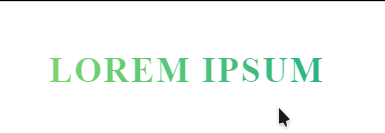

#### Gradient Text with skew on hover effect




```html
<h2 class="heading-secondary">
    Lorem Ipsum
</h2>
```

```scss
.heading-secondary {
  font-size: 3.5rem;
  letter-spacing: 2px;
  text-transform: uppercase;
  font-weight: 700;
  background-image: linear-gradient(to right, #7ed56f, #28b485);
  display: inline-block;
  -webkit-background-clip: text;
  color: transparent;
  transition: all .2s; }
  .heading-secondary:hover {
    transform: skewY(4deg) skewX(15deg) scale(1.1);
    text-shadow: 0.5rem 1rem 2rem rgba(0, 0, 0, 0.2); }
```

